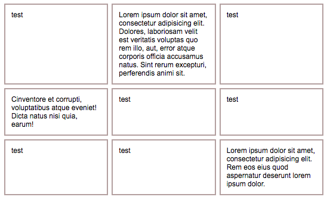

# height
> Apply the same height for your columns. Row by row.


## Install

```
$ npm install --save height
```


## Usage

```javascript
var options = {
  listElem: 'ul .item',
  columns: 3
};

Height(options);
```

Result:




## Related

- [nth-rocks](https://github.com/alisonmonteiro/nth-rocks) - Don't break your lists.


## License

MIT © [Alison](http://alisonmonteiro.com.br)
